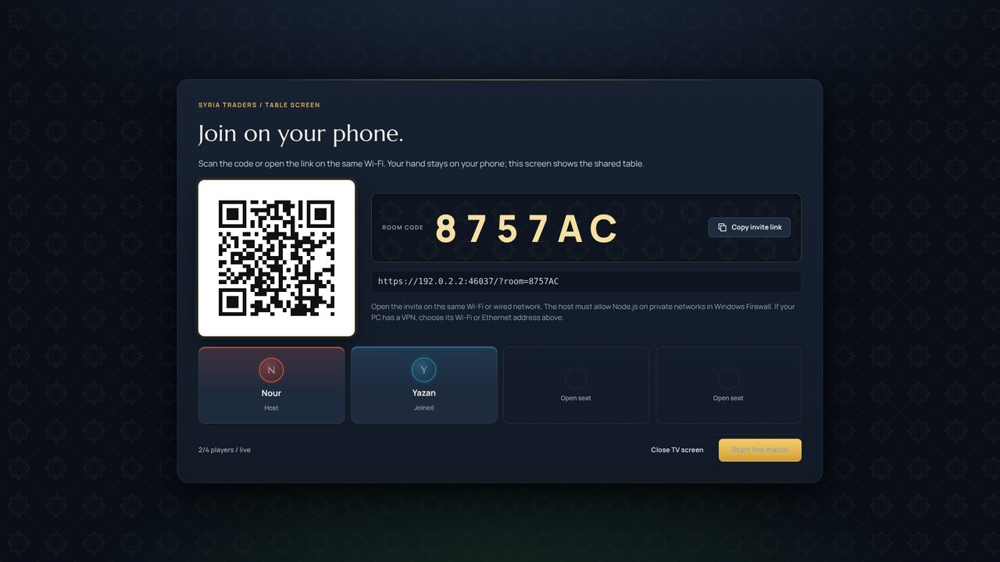

# Syria Traders

An original Syrian-inspired resource, trading, and settlement game. React, plain CSS, Node.js, Express, and an SVG board. Supports 2-6 people sharing a screen or joining a room from separate browsers on the same local network.

New to the game? Read **[How to Play](docs/HOW-TO-PLAY.md)** for the rules explained from scratch.

## Quick Start

You need one computer to be the **host** (it runs the game server) and **Node.js 24** installed on it from [nodejs.org](https://nodejs.org/). Everyone else only needs a browser on the same Wi-Fi.

**Example 1: two players on one laptop.**
Double-click `run-game.bat`. The game opens at `https://localhost:8443` (accept the certificate warning, it is expected). Choose **One device**, type both names, arrange the map if you like, and start. You pass the laptop between turns, so hands are not private in this mode.

**Example 2: everyone on their own phone, with a TV showing the board.**

1. On the host PC, double-click `run-game.bat` and keep its window open.
2. The window prints a **TV:** address like `http://192.168.1.50:8080/tv` (your PC's own address will differ). Type it into the TV's browser and press **Open a room on this TV**. The TV now shows a room code and a QR code.
3. Each player scans the QR code with their phone (or opens the invite link), types their name and taps **Join the table**. Accept the certificate warning once.
4. When everyone is in, press **Start the match** on the TV or on the first phone that joined.



*The TV waiting for players. Phones scan the QR code or type the room code.*

**Example 3: everyone on their own laptop or phone, no TV.**
On the host PC choose **Host room**, enter your name and create the room. Send the lobby invite link to the others (it uses the PC's network address, for example `https://192.168.1.50:8443/?room=ABC123`). They open it, enter their names and join, then the host presses **Start the match**. Anyone can also choose **Join room** and type the six-character room code.

**For developers (any OS):**

```sh
npm run install:all      # install root, server and client packages
npm run build            # build the client into client/dist
npm start                # serve https://localhost:8443 (+ TV address on :8080)
npm run dev              # or: hot-reload development on https://localhost:5173
npm test                 # rules, cards, trading, TV and session tests
```

If something does not connect, check that every device is on the same Wi-Fi (not a guest network), that Windows Firewall allows Node.js, and that the host window is still open. Details for each setup follow below.

## Start Playing (Windows)

Install **Node.js 24 or newer**, then double-click **run-game.bat**. It installs missing dependencies, builds the latest UI, starts HTTPS, and opens **https://localhost:8443**. Keep its window open while playing; Ctrl+C stops the host.

The certificate is self-signed. A warning is expected on your own host and your friends' devices. Verify the address belongs to your host PC before proceeding. No certificate trust or firewall settings are changed automatically. Stop any previous game/dev server first if port 8443 is busy.

Port 8443 now serves both the built game and API. Rebuilding on launch prevents accidentally serving an older screen.

### Play With Friends on Your Network

1. Choose **Host room**, enter your name, customize the map, and create the room.
2. Copy the lobby invite. It uses the host's LAN IP instead of `localhost`. If several adapters exist, select your Wi-Fi/Ethernet address, not a VPN/virtual adapter.
3. Friends open the link on the same network, enter their names, and choose **Join the table**. They may need to accept the local certificate warning.
4. Allow Node.js on **Private networks** in Windows Firewall if prompted. Do not disable the firewall. Guest Wi-Fi/client isolation can prevent devices reaching each other.
5. Wait for 2-6 players (choose **Up to 6 players** under Seats when creating the room), then the host presses **Start the match**. Joining does not auto-start the room at two players.

Each browser has its own player seat and private hand. Only the active player can act. To test several players on one PC, use separate profiles/incognito contexts, not tabs sharing browser storage. Keep the host PC awake and its server running. This is trusted-LAN multiplayer, not public internet matchmaking.

### Phones and a TV

Everyone plays on their own phone while a TV shows the shared table.

1. On the PC connected to the TV, open the game, choose **TV screen** and press **Open a room on this TV**. Arrange the map first if you like.
2. Players scan the QR code (or open the link) on the same Wi-Fi, enter their names and join. Phones show your own hand first, then the actions and board.
3. Press **Start the match** on the TV. The first phone to join can start it too.

**Without a PC on the TV:** type the **TV:** address from the box in the host window into the TV's own browser. It looks like `http://<your PC's address>:8080/tv`, using the PC's Wi-Fi or Ethernet address (virtual adapters such as WSL or Hyper-V are listed last). It opens straight to the TV screen with **Open a room on this TV** selected, so the remote's OK button starts a room. To show a room a phone already hosts, enter its room code there instead. Hosts also see this address in their lobby.

- That address is plain HTTP so TV browsers don't block the self-signed certificate. Only table screens can use it: the server refuses player seats and joins there, and the TV never receives hands. The QR code still sends phones to HTTPS.
- The build includes a fallback bundle for older TV browsers. It was checked in Chromium 63 and 69 (roughly 2019-2020 Samsung and LG TVs), but not on a real TV.
- Set `TV_PORT` to change port 8080, or `TV_PORT=off` to turn the address off.
- Google TV and Android TV have no browser built in: install one from the Play Store, such as TV Bro. These browsers report a small screen (about 960x540), so table screens ask to be laid out 1920 wide and scaled to fit. If a browser ignores that and the TV shows the narrow layout, cast a Chrome tab from a laptop instead.

The TV always shows what a road, village and city cost.

**Animations:** when anyone rolls, every screen tumbles its dice and the TV shows a big dice roll. Paid-out cards fly from the producing tiles to each player's card on the TV with a short "+2" badge (trades fly between the two players), new roads and buildings pop onto the board, the bandit drops onto its new region, and each new event is announced briefly over the board. Amounts are never kept on the TV: the server sends them to the TV for 8 seconds only, and the log now says who was paid, not how much. Each phone still shows its own gains. Reduced-motion settings turn the movement off.

**Five or six players:** one-device games with five or six names, and rooms created with **Up to 6 players** under Seats, play on a larger 30-territory map (11 extra Syrian regions, 28 number tokens, 11 harbors) with two more player colours. Up to four players keep the classic 19-territory map, and saved games load on the map they started with. The official 5-6 player "special building phase" between turns is not included.

**Trading between players (network rooms):** after rolling, the active player chooses a resource and amount and presses **Ask players**. Other phones that hold those cards can offer them for something in return (1-4 cards of one resource). The active player accepts one offer or declines them; the server swaps the cards only if both hands still have them. Requests and offers are public, like at a real table, and the TV shows them read-only. An open request closes at the end of the turn.

To show a room a phone already hosts, choose **TV screen** and enter its room code, or open `/?room=CODE&tv=1`. This works mid-match.

The TV is a read-only seat-less viewer. The server never sends it hands, gain details or move hints; it shows the board, dice, turn, scores, piece counts, card counts per hand, the bank and the log (the same public information every player already sees). Moves sent with a TV token are rejected. **Close TV screen** revokes its token without touching any seat. Anyone with the room code on your network can open a TV view, so it shows nothing private.

Leaving a lobby frees your seat. If the host leaves, the next player becomes host. An empty room closes. After a match starts, seats cannot be removed or reassigned.

## Development

```sh
npm install
npm run install:all
npm run dev
```

Open **https://localhost:5173** for Vite hot reload. `/api` is proxied to the HTTPS backend on port 8443. Other devices can use `https://HOST_LAN_IP:5173` too.

Browser storage is origin-specific: ports 5173 and 8443, `localhost`, and a LAN IP each have separate saved seats. Use the same address to resume a match.

For the built app without the launcher:

```sh
npm run build
npm start
```

Server options: `PORT` (default 8443), `LISTEN_HOST` (default `0.0.0.0`, all interfaces for LAN play), `HTTPS` (default on; `HTTPS=0` serves plain HTTP), `TV_PORT` (plain-HTTP smart-TV address, default 8080, `off` to disable), `GAME_DATA_DIR` (default `server/data`), optional comma-separated `ALLOWED_ORIGINS` for a separately hosted frontend. Same-origin is the default. `VITE_API_BASE_URL` is an optional client build-time override. Do not expose this development server directly to the public internet.

### Cloud Preview

For a cloud workspace whose preview proxy already provides HTTPS:

```sh
npm run start:preview
```

It builds, then serves plain HTTP on `0.0.0.0:8080` with the smart-TV port off. Open it through the preview's https URL; a plain `http:` page opens the TV screen. `PORT`, `LISTEN_HOST`, `HTTPS` and `TV_PORT` override those defaults. For Vite hot reload behind a preview proxy, set `HTTPS=0`, `DEV_PORT` and `DEV_ALLOWED_HOSTS` (comma-separated preview domains) before `npm run dev`. Local play, `npm start` and `run-game.bat` are unchanged: HTTPS on 8443 plus the smart-TV address on 8080.

## Rules and Feedback

- Setup is separate from play. Add names/photos, reorder 19 territories (30 for five or six players), upload terrain, randomize map/ports, or manually swap number tokens. Balanced numbers keep adjacent 6/8 tiles apart.
- Everyone first rolls the dice for turn order, each on their own phone (a shared screen rolls for each player). The highest roll places first and takes turn 1, the next highest second, and so on; tied players roll again among themselves. After 30 seconds anyone may roll for a player who hasn't.
- Place a village and adjacent road, then reverse player order for the second placement. Your second village grants starting resources.
- Roll once per turn. Matching regions produce one resource per village, two per city, unless blocked by the bandit.
- Build along your own network. Villages must be at least two edges apart. An opponent's settlement blocks road continuation. Limits: 15 roads, 5 villages, 4 cities per player.
- Bank trades cost four identical cards. Occupy a port endpoint for 3:1 on any resource or 2:1 on its specific resource. Piers show the exact port sites.
- On seven, everyone holding more than seven cards chooses half of them (rounded down) to return to the bank, on their own phone; the bandit waits until they have. If someone has not chosen after a minute, the roller can return their cards at random. Move the bandit to block any territory (it produces nothing while blocked). Tapping a territory only previews the move, so a mistaken tap can be changed; the move happens when the player confirms, or chooses one opponent with a village or city there and take a random card from them. With only one such opponent the card is taken straight away. Only the thief and the victim see which card it was; everyone else and the TV see "X stole a card from Y".
- If the bank cannot fulfill all claims for a resource on a roll, nobody receives that resource. Other resources still pay normally.
- Development cards cost 1 Wheat, 1 Sheep and 1 Stone, bought after rolling from a shuffled 25-card deck: 14 Knight, 5 Victory Point, 2 Road Building, 2 Year of Plenty, 2 Monopoly. Play one card per turn, never on the turn you bought it (a Knight may be played before rolling). A Knight moves the bandit and steals; Road Building places two free roads; Year of Plenty takes any two resources from the bank; Monopoly collects every opponent's stock of one resource. Victory Point cards stay hidden and are revealed automatically when they win the match.
- Largest Army: the first player to play 3 Knights gains 2 points, and loses them to anyone who later plays more.
- Longest Road: the first unbroken road of 5 or more gains 2 points. A longer road takes it; a tie leaves it with the holder. Another player's village or city cuts a road where it stands, and if the holder's road is cut so that several players share the longest, nobody holds it until one pulls ahead.
- First to 10 points wins. Villages are worth 1; cities 2. Points gained off-turn (a rival's road cut) count when your turn starts. No AI players yet. Player-to-player trades work in network rooms.
- "Anyone have...?" requests: a player waiting for their turn posts what they need and what they give for it. It shows on the TV and every phone, and whoever is playing can take it with one tap after rolling. One request per player; it ends when taken, taken back, or when its owner's turn starts.
- Reactions: a seated phone's 😀 button sends an emoji or a short line ("Nice try!", "Trade with me!"...). It rises over the sender's card on the TV and other phones for a few seconds. Reactions are never saved and never change the match revision, so they can't block a move.
- Sounds: the TV plays dice, payouts, the bandit, steals, trades, builds, cards, awards, the win and reactions (toggle in its header; browsers stay silent until the screen is first touched or a remote key is pressed). Phones play the same sounds when their Sound button is on.
- When a match ends, the TV and phones show awards (Lucky harvest, Master thief, Most robbed, Trade king, Bandit's friend, Road builder, Knight commander; ties share) and a chart of how the dice fell. They count only public events; saves from before awards count from their next move.
- Development card hands are private like resources: other phones and the TV see only each player's card count and knights played. Saves from before development cards load with a fresh deck.

Gain badges stay beside resource counts for **30 seconds**, fade over 700 ms, then clear. Simultaneous resources use separate rows. Repeated gains aggregate while each event retains its expiry. Dice production also briefly lights up producing tiles. Uploaded art locks after setup.

## Saves and Recovery

The **server is authoritative**, including shared-screen games. Every accepted move writes `server/data/<game-id>.json` using a temporary file and atomic rename. The server reloads these files on restart.

The browser stores its seat token and latest permitted snapshot under `syria_traders_save_v1`. Artwork is separate under `syria_traders_art_v2`, avoiding large photo writes on every move. Setup drafts use `syria_traders_setup_v2` until a match is successfully created/joined; then the redundant draft is removed to make room for the finalized art. Refresh reconnects the saved seat and fetches the latest revision. Moves lock during disconnection and reconnect automatically. A phone waking from sleep reconnects at once with the same seat and hand. Each open game tab holds one of the browser's roughly six connections to the host, so a tab that is not on screen hands its live connection to the tab that is, and takes it back when shown again.

Back up `server/data` to preserve games. Browser data is also needed for player access. **New table** forgets this browser's seat after confirmation; clearing browser data does the same. Account-based seat recovery is not implemented. Do not share save files or seat tokens.

Pre-upgrade browser snapshots without a session cannot safely be imported as network games. They are not automatically removed; setup warns that a new match will replace the browser save. Existing server files are not deleted.

## Layout and Performance

- Letterboxed 16:9 desktop dashboard (widths 1200px and above). No main-page scrolling at tested desktop sizes; the log has its own permanent scrollbar.
- Four players use a 2x2 grid instead of four squeezed vertical cards; five or six use 2x3 with each hand shown as one row of counts. Resource rows are at least 24px with 8px gaps. Gain badges have a reserved gutter.
- Smaller/portrait devices reflow and allow page scrolling. Readability takes priority over forcing a desktop layout onto a phone.
- The SVG board fits its actual bounds. Labels, tokens, roads, and keyboard-accessible build targets scale together.
- Original local SVG illustrations replace unrelated external photos. Custom images are cropped/resized before upload. Included illustrations are not documentary photos of the regions.
- Server-sent events send tiny revision notices instead of constant full-state polling. Artwork is sent on initial sync/lobby changes, not each move.
- Request timeouts, duplicate-click locks, revision checks, and player authentication guard actions. Opponent resource breakdowns never leave the server in network rooms.

## Code Map

```text
client/
  public/terrain/            Original resource illustrations
  src/
    App.jsx                 Setup/lobby/game routing
    api/gameApi.js          Authenticated requests and live stream
    components/
      GameSetup.jsx         Names, avatars, map arrangement, custom art
      Lobby.jsx             Invitations, seats, host-controlled start, TV QR code
      TableStatus.jsx       TV screen turn summary, bank and building costs
      TradePanel.jsx        Player-to-player trade requests, offers and "Anyone have...?"
      Reactions.jsx         Reaction button and the bubbles over player cards
      MatchSummary.jsx      End-of-match awards and dice chart
      SeatHand.jsx          Phone strip with your own hand
      QrCode.jsx            Invite link as an SVG QR code
      GameBoard.jsx         SVG map, ports, placement targets
      PlayerCard.jsx        Avatar, score, aligned rows, gain badges
      Sidebar.jsx           Player grid
      ActionBar.jsx         Dice/build/trade controls and costs
      DiceDisplay.jsx       Graphical dice
      AnimatedNumber.jsx    Resource count transition
      GameLog.jsx           Scrollable history
      ResourceIcon.jsx      Original vector icons
    hooks/
      useMatch.js           Save/load, reconnect, guarded actions
      useResourceGains.js   Badge expiry and aggregation
      useGameSounds.js      Table sounds for what just happened
    styles/
      index.css             Theme and shared elements
      app.css               Dashboard, board, setup, responsive layout
      PlayerCard.css        Card and resource layout
      table.css             TV screen and phone seat layout
    utils/
      storage.js            Session snapshot and artwork cache
      sound.js              Synthesized tap and table sounds
      images.js             Photo validation, resize, URL cleanup
  test/feedback.test.mjs
server/
  src/
    index.js                HTTPS, LAN URLs, optional browser launch
    app.js                  API and built frontend hosting
    routes/gameRoutes.js    Protected actions and SSE
    game/
      boardGenerator.js     Geometry and coastal ports
      gameService.js        Turn flow, production, building, scoring
      rules.js              Placement, harbor discounts, longest road length
      stats.js              Match statistics and end-of-match awards
      reactions.js          Live, unsaved player reactions
      sessions.js           Seats, authorization, private game views
      gameStore.js          Atomic disk saves and revision events
  test/game.test.js
  test/table.test.js        TV screen never receives private data
  test/trade.test.js        Player trades swap only the agreed cards
  test/fun.test.js          Longest Road, requests, awards and reactions
  data/                     Generated saves (ignored)
shared/gameConfig.json      Regions, resources, colors, costs, tokens
scripts/
  create-terrain.cjs         Regenerate original SVG art
  browser-smoke.cjs          Isolated multi-browser acceptance tests
run-game.bat                Windows play launcher
```

The generator shares rounded corners between neighboring tiles, then creates edges and adjacency lists. The 19 land tiles have **54 vertices and 72 edges**, surrounded by 18 sea hexes. Nine ports attach to distinct coastal edge pairs. The large map (`largeBoard` in `shared/gameConfig.json`) has 30 land tiles, 80 vertices, 109 edges, 22 sea hexes and 11 ports; `boardSpec(size)` picks the layout and the sea ring is built from whatever water touches the land. Rules operate on these IDs, not screen coordinates. Near-zero coordinates are normalized so floating-point `-0` cannot split a shared corner.

## API

`POST /api/games` creates a match and returns a game plus secret seat token. Send `{ "mode": "online", "tableHost": true, "playerNames": [] }` to open a room hosted by a TV screen. `POST /api/games/:id/join` joins an unstarted network room using its ID or six-character code. `POST /api/games/:id/table` opens a read-only TV screen for a network room (any phase) and returns its token.

The following routes require `Authorization: Bearer <token>`. Mutations also require `X-Game-Revision: <latest revision>`; stale moves return 409 and must be retried after refresh.

- `GET /api/games/:id` (add `?media=1` for artwork)
- `GET /api/games/:id/events` (SSE revisions)
- `POST /api/games/:id/start` (host only)
- `POST /api/games/:id/leave` (before start; own seat only. A TV token closes that TV screen in any phase)
- `POST /api/games/:id/order/roll` (opening roll for turn order while `phase` is `order-roll`; `{ "forPlayerId": "..." }` rolls for someone else, at once on a shared screen or after 30 seconds in a network room. Like discards, it doesn't need the latest revision)
- `POST /api/games/:id/setup/place`
- `POST /api/games/:id/roll`
- `POST /api/games/:id/build/road`
- `POST /api/games/:id/build/village`
- `POST /api/games/:id/build/city`
- `POST /api/games/:id/trade/bank`
- `POST /api/games/:id/trade/request`, `trade/offer`, `trade/withdraw`, `trade/accept`, `trade/decline`, `trade/cancel` (player trades; these name the request or offer instead of needing the latest revision)
- `POST /api/games/:id/wish/post` (`{ "want": { "resource": "wheat", "amount": 1 }, "give": { "resource": "brick", "amount": 1 } }`, by a player waiting for their turn), `wish/withdraw`, `wish/accept` (`{ "wishId": "..." }`, by the active player after rolling). Like trades, these don't need the latest revision
- `POST /api/games/:id/react` (`{ "reaction": "laugh" }`, a key of `reactions` in `shared/gameConfig.json`; network rooms only, one per player every 1.2 s). Sent to every screen on the SSE stream as `reaction`, never saved
- `POST /api/games/:id/dev/buy`
- `POST /api/games/:id/dev/play` (`{ "type": "knight" | "roadBuilding" | "yearOfPlenty" | "monopoly" }`, plus `resources: [a, b]` for Year of Plenty or `resource` for Monopoly)
- `POST /api/games/:id/discard` (`{ "cards": { "wood": 2, ... } }` after a seven, matching `pendingDiscards`; the roller may send `{ "forPlayerId": "..." }` after a minute for random cards. Like trades, it doesn't need the latest revision)
- `POST /api/games/:id/robber/move` (`{ "tileId": 4, "victimId": "..." }`; `victimId` is needed when several opponents on the territory hold cards, listed in `hints.robberVictimsByTile`)
- `POST /api/games/:id/end-turn`

`GET /api/health` is public. Network actions can only name the authenticated player. In shared-screen mode, one local session controls all seats.

## Verification

```sh
npm test
npm run build
```

Node tests cover topology, placement for 2/3/4/6 players, the large map, production, shortages, robber/discards, road blocking, ports, limits, victory, disk reload, authorization, stale actions, SSE, popup timing, and save helpers.

Playwright is a pinned dev dependency. Installed Chrome/Edge is used automatically on Windows; otherwise install its matching Chromium once with `npm run browsers:install`. Then:

```sh
npm run build
npm run test:browser
HTTPS=0 npm run test:browser   # host in HTTP mode behind a local TLS proxy, like a cloud preview
```

GitHub Actions runs the Node tests, build and both browser runs on Node 24 for every pull request.

Optional `CHROME_PATH` selects a browser executable; `PLAYWRIGHT_MODULE` selects an existing Playwright installation. Tests launch an isolated HTTPS host with separate data in `test-results`, drive four independent browser contexts, verify layouts and refresh/restart recovery, and save screenshots. They do not use your real saved matches.
