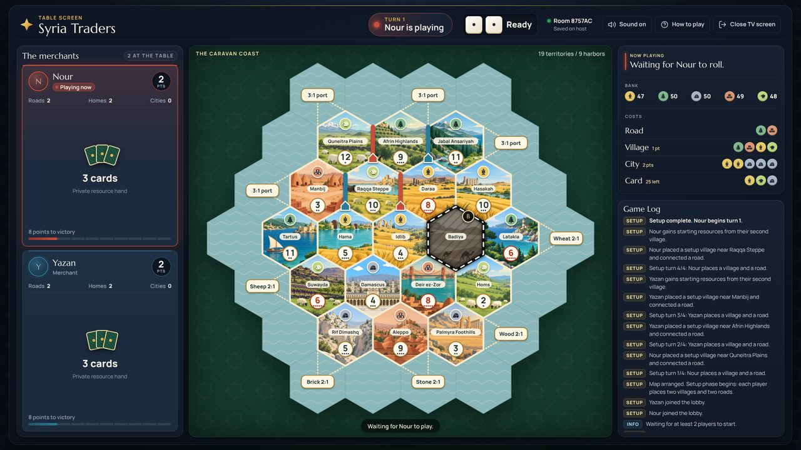
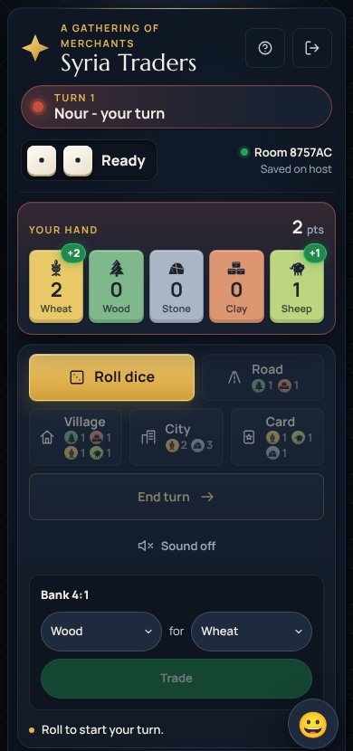
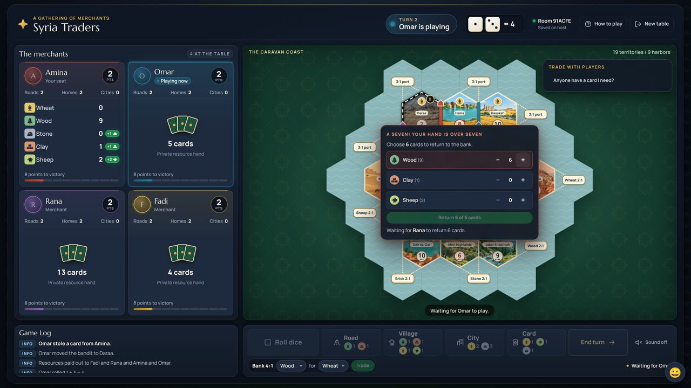
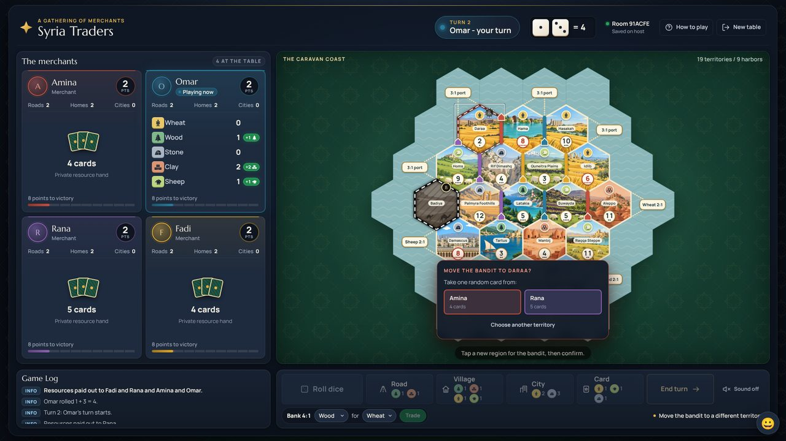
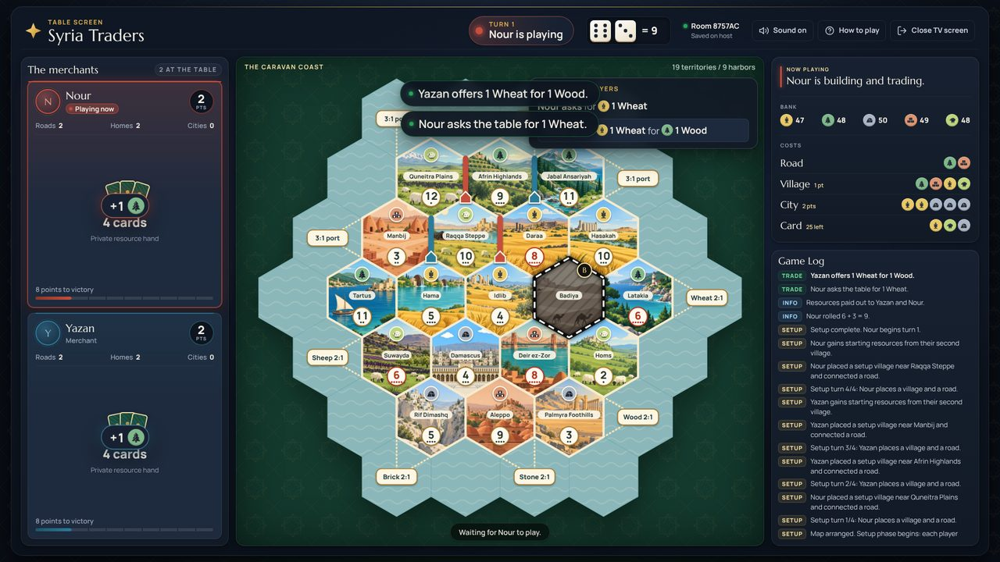
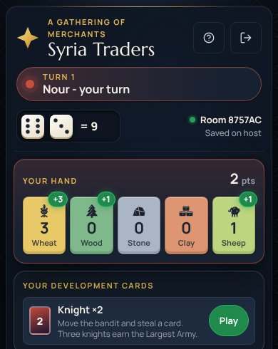

# How to Play Syria Traders

A guide for someone who has never played a trading and building board game before. If you already know Catan, the short version is: it plays like Catan with Syrian regions, villages instead of settlements, a bandit instead of a robber, and phones as your private hands.

To start the game itself, see [Quick start in the README](../README.md#quick-start).

## The goal

Be the first player to reach **10 points**. You earn points by building on the map:

| What | Points |
| --- | --- |
| Village | 1 |
| City (an upgraded village) | 2 |
| Victory Point card (kept secret until it wins) | 1 each |
| Largest Army (first to play 3 Knights) | 2 |
| Longest Road (first unbroken road of 5 or more) | 2 |

Points you get on someone else's turn count when your own turn starts.

## The map and the five resources

The board is a map of Syrian regions, each drawn as a six-sided tile. Every region produces one resource:

| Resource | Regions on the classic map |
| --- | --- |
| Wheat | Idlib, Hama, Daraa, Hasakah |
| Wood | Latakia, Tartus, Jabal Ansariyah, Afrin Highlands |
| Stone | Damascus, Rif Dimashq, Palmyra Foothills |
| Brick (shown as Clay on cards) | Aleppo, Deir ez-Zor, Manbij |
| Sheep | Homs, Suwayda, Raqqa Steppe, Quneitra Plains |
| Nothing | Badiya (the desert, where the bandit starts) |

Each region has a **number token** from 2 to 12. When the dice show that number, the region produces.

- Two dice are rolled, so middle numbers come up most. 6 and 8 are printed in red because they are the most common numbers that pay out. 2 and 12 are the rarest.
- 7 has no region. Rolling a 7 wakes the bandit (see below).

*The TV shows the whole table. Each region has its picture, resource icon and number token. The striped desert (Badiya) holds the bandit, marked B.*

Up to four players use the classic 19-region map. Five or six players use a bigger 30-region map with more regions, numbers and harbors.

## What things cost

You pay resource cards to the bank to build:

| Build | Cost | Gives you |
| --- | --- | --- |
| Road | 1 Wood + 1 Brick | Lets you reach new spots |
| Village | 1 Wood + 1 Brick + 1 Wheat + 1 Sheep | 1 point, collects from up to 3 regions |
| City | 2 Wheat + 3 Stone (replaces one of your villages) | 2 points, collects double |
| Development card | 1 Wheat + 1 Sheep + 1 Stone | A random special card |

Each player has at most 15 roads, 5 villages and 4 cities. The TV and the action bar always show these costs, so nobody has to remember them.

## Setting up the board

Before the first turn everyone places two villages and two roads for free.

1. In turn order, each player places one village on a corner where regions meet, plus one road touching it.
2. Then the order reverses (the last player goes again first) and everyone places a second village and road.
3. Your **second** village immediately gives you one card from each region it touches. That is your starting hand.

Tip: corners touching three regions with common numbers (6, 8, 5, 9) and different resources are the strongest spots.

## Your turn, step by step

1. **Roll the dice** (press **Roll dice**). Every village or city touching a region with that number collects from it: 1 card per village, 2 per city. This happens for everyone, not only the roller.
2. **Trade** if you want (see Trading).
3. **Build** what you can afford, as many things as you like.
4. Optionally **play one development card**.
5. Press **End turn**. The next player rolls.

*Your phone at the start of your turn. Your hand is at the top (the green +2 shows cards you just got). Buttons you can't use yet are greyed out.*

You can do steps 2-4 in any order and repeat them, but always roll first. A Knight card is the one thing you may play before rolling.

If the bank does not have enough of a resource to pay everyone who earned it on a roll, nobody gets that resource that time. Other resources still pay.

### Where you can build

- **Roads** go along the edges of regions and must connect to your own road, village or city. An opponent's village or city on a corner blocks your road from continuing through that corner.
- **Villages** go on a corner touched by one of your roads, and no other village or city may be on a neighbouring corner (so two buildings are always at least two roads apart).
- **Cities** replace one of your own villages.

The board highlights the spots where you are allowed to build.

## Rolling a 7: the bandit

A 7 produces nothing. Instead:

1. **Too many cards:** anyone holding more than 7 resource cards must give half of them back to the bank (rounded down; 9 cards means returning 4). Each player picks which cards on their own phone. If someone has not chosen after a minute, the roller can return their cards at random.
2. **Move the bandit:** the roller moves the bandit to any other region. Tap a region to preview, then confirm, so a wrong tap can be changed. The region with the bandit produces nothing until the bandit moves again.
3. **Steal:** the roller takes one random card from one opponent who has a village or city on that region. If several opponents are there, the roller picks whom to rob. Only the thief and the victim see which card it was; everyone else sees "X stole a card from Y".

The blocked region looks faded with a black-and-white striped border.

*After a 7, a player with 12 cards chooses which 6 to give back.*

*Moving the bandit onto Daraa. Two opponents live there, so the roller picks whom to rob.*

## Trading

Trading is how you turn cards you have too many of into cards you need.

**With the bank (any time on your turn after rolling):**

- 4 identical cards for 1 card of your choice.
- If you own a village or city on a **harbor** (the piers on the coast), you get a better rate: a **3:1** harbor trades 3 identical cards for 1, and a resource harbor (for example "Wheat") trades 2 of that resource for 1.

**With other players (rooms where everyone has their own phone):**

- After rolling, the active player picks a resource and an amount (1-4) and presses **Ask players**. Example: "I want 2 Stone".
- Other players who hold those cards can offer them and say what they want back (1-4 cards of another resource). Example: "Here are 2 Stone, give me 1 Wheat".
- The active player accepts one offer or declines them. The swap only happens if both still have the cards. The request closes at the end of the turn.

*A trade on the TV: Nour asks for 1 Wheat, Yazan offers it for 1 Wood. Nour accepts on their phone.*

**"Anyone have...?" requests:** while it is not your turn, you can post what you need and what you give. Example: "Anyone have 1 Wood? I give 1 Sheep." It shows on the TV and every phone. Whoever is playing can accept it with one tap after rolling. Each player has one request at a time, and it ends when someone takes it, when you take it back, or when your own turn starts.

## Development cards

Buy them for 1 Wheat + 1 Sheep + 1 Stone after rolling. They come from a shuffled deck of 25 and stay secret in your hand.

| Card | How many | What it does |
| --- | --- | --- |
| Knight | 14 | Move the bandit and steal a card, just like a 7 (but nobody discards) |
| Victory Point | 5 | Worth 1 point. Stays hidden and is revealed automatically when it makes you win |
| Road Building | 2 | Place two roads for free |
| Year of Plenty | 2 | Take any two resources from the bank |
| Monopoly | 2 | Name a resource; every opponent gives you all of theirs |

- Play at most one card per turn.
- You can't play a card on the turn you bought it.
- A Knight may be played before you roll.

*Your development cards appear under your hand, with a Play button.*

**Largest Army:** the first player to have played 3 Knights gets 2 points. If someone else later plays more Knights than the holder, the 2 points move to them.

## Longest Road

The first player with an unbroken road of 5 or more segments gets 2 points. Someone with a longer road takes it over; a tie leaves it with the current holder. A rival's village or city built in the middle of your road cuts it there. If the holder's road is cut and several players then share the longest road, nobody holds it until one pulls ahead.

## Winning

The match ends the moment a player reaches 10 points on their turn. First the TV plays a short victory finale with fireworks. Then every screen shows **the match in numbers** (points, roads, homes, cities, dice cards, trades, steals and knights for every player), the **end-of-match awards** (for example Lucky harvest, Master thief, Most robbed, Trade king, Bandit's friend, Road builder, Knight commander; ties share an award) and a chart of how the dice fell during the match.

## Having fun at the table

- **Reactions:** press the 😀 button on your phone to send an emoji or a short line such as "Nice try!", "Trade with me!" or "Revenge!". It pops up big on the TV over your player card for a few seconds.
- **Sounds:** the TV plays sounds for dice, payouts, the bandit, steals, trades, builds, cards and the win. Use the sound button in the TV header to turn them off. A TV browser stays silent until someone presses a remote key or touches the screen once. Phones play them too when their Sound button is on.

## What stays private

- Your resource cards and development cards are only on your own phone. Other players and the TV only see how many cards you hold and how many Knights you have played.
- The TV never shows anyone's hand.

## Beginner tips

- Spread your first two villages across different resources, especially Wood and Brick (for roads and villages) early on.
- Cities double your income, so Wheat and Stone matter more later.
- Keep 7 cards or fewer when you can, so a 7 does not cost you half your hand.
- Build on a harbor if you collect a lot of one resource.
- Trade often. A fair trade that helps both of you is better than waiting.
